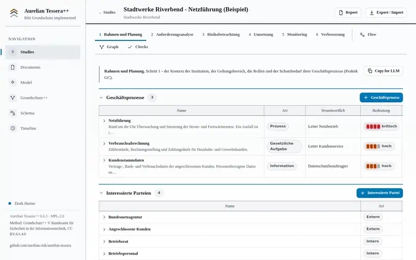

# Aurelian Tessera++

**An ISMS tool for the BSI's Grundschutz++ method - one HTML file, no server, no account, no network.**

Download it, double-click it, work. The complete Anwenderkatalog Grundschutz++ is already inside: all 1000 requirements, the target-object hierarchy, the BSI's mappings to IT-Grundschutz and ISO 27001.

[**↓ Download the current build**](https://github.com/aurelian-risk/aurelian-tessera/releases/latest/download/aurelian-tessera.html) - 4 MB, single file, runs in Edge or Chrome straight from disk.



---

## Key motivation

Grundschutz++ defines a method rather than a checklist. Determining the applicable requirements for a given institution requires widening the target-object categories along the BSI hierarchy, consolidating the requirements they carry, adding the ISMS practices, and retaining the reference between each requirement and the asset that introduced it. Maintaining this derivation by hand - in spreadsheets or text documents - is laborious and difficult to reproduce as the information domain changes.

Established server-based ISMS platforms support this work, but the effort of deploying and operating them is not always proportionate to the size of the institution. In segregated or otherwise restricted environments, software requiring a server component or network access may not be permissible at all.

Aurelian Tessera++ is intended for the space between these options: the method as published, executed in a single file that requires no installation, no server and no network connection.

## Getting started

1. Download [`aurelian-tessera.html`](https://github.com/aurelian-risk/aurelian-tessera/releases/latest/download/aurelian-tessera.html) - the same file at that address for every release.
2. Open it in Edge or Chrome.
3. Describe your first business process and its assets. The requirements follow.

Your data stays in your browser's local storage. Nothing is uploaded, nothing is reported, no update is fetched behind your back.

## What you do with it

**Describe the institution.** Business processes, and how badly you'd be hurt if each lost confidentiality, integrity or availability. Then the assets that carry them - the control system, the network, the directory service, the maintenance contract.

**Assign target-object categories.** The BSI's own classes: *IT-Systeme*, *Netze*, *Externe Netzanschlüsse*, *Dienstleistungen*. This single choice is the actual work.

**Let the package derive itself.** Categories are widened along the BSI hierarchy, requirements collected, duplicates carried once, ISMS practices added whole. Every requirement records which asset brought it in and through which category - so any asset can be asked what it carries, which is what an auditor will ask. Add another asset, re-run the derivation, and the package grows by exactly what that asset contributed.

**Work the register.** All 1000 requirements are present; the ones your assets pulled in are live, the rest greyed out until you decide they apply. Filter by scope, modal verb or security level. Mark each implemented or not - the method knows no "partly", and a requirement counts as met only if its dependencies are met too. Set priority, owner, due date. Where you can't implement one, record an exception: who authorised it, why, until when.

**Migrate what you already have.** Every requirement names its counterpart in the IT-Grundschutz-Kompendium 2023 and ISO/IEC 27001 Annex A, with how close the correspondence is - the BSI's own mapping. Work already done can be carried across instead of redone.

**Model the risk where the method demands it.** A process with high protection needs, a requirement left open: build the attack chain step by step, see which of your measures stop it where, and where residual risk sits after treatment. Grundschutz++ leaves this method open; this is one answer to it.

**Model the attack in MITRE ATT&CK terms.** A chain is a sequence of steps, each carrying one of the 14 ATT&CK tactics and, where you want the detail, a technique - `T1078 Valid Accounts`, `T1486 Data Encrypted for Impact`. Fifty common techniques are bundled for an offline typeahead; the field is free text, so anything outside that set can be typed. Steps are not merely a list: a step names the ones that have to succeed before it, which makes the chain a directed graph rather than a straight line, and the graph is what the analysis reads.

Measures attach to steps, not to the chain as a whole, and each carries what it actually does - preventive, detective, corrective, deterrent, avoidance. From that the tool says where an attempt is stopped and where it is only watched: a chain can be fully attended to and still block nobody. The tactic heatmap shows the same by tactic, so a gap that runs across several chains is visible as a column rather than as an incident in one of them.

**Print the security concept.** Registers, figures, decisions and their reasons, the catalogue version you worked to, and the full change history - every edit with author, timestamp and reason, hash-chained so a later reader can verify nothing drifted.

## What's inside

| | |
|---|---|
| Requirements | 1000, with modal verb, security level, effort level, security objectives, threats |
| Target-object categories | 39, as a hierarchy - 7 roots, 4 levels |
| Dependencies | 67 edges the catalogue states between its own requirements, plus 210 weaker relations |
| Mappings | IT-Grundschutz 2023 (1185 entries) and ISO/IEC 27001 Annex A (96), each with correspondence strength |
| Published implementations | 35 BSI components, each naming the requirements it answers |
| Currency | Ruleset and mappings are fetched from the BSI repository at every build; a running copy can be refreshed manually |
| Attack modelling | 14 MITRE ATT&CK tactics, 50 bundled techniques for an offline typeahead, free text beyond them |
| Conformance | measured against the BSI's own machine-readable method catalogue - [`docs/method-conformance.md`](docs/method-conformance.md) |

## Who it's for

Anyone writing or maintaining a security concept to Grundschutz++ - in an institution too small for a server-based ISMS suite, or in an environment where a networked tool can't be installed at all.

It is not a certification. Whether a concept produced with it satisfies a scheme is decided by the certification body.

## Build it yourself

```bash
npm install
npm run build      # fetches the current ruleset, then builds → dist/index.html
npm run test:e2e   # 243 checks against the built file, without network
```

## About Aurelian Risk Manager

Aurelian Tessera++ is the free, open-source, offline companion to **Aurelian Risk Manager** - *AI-driven cyber risk analysis*.

Aurelian Risk Manager is an enterprise platform that automates the full assessment end to end: AI agents turn an organisation's documentation and threat intelligence into quantified, auditable risk analyses on a unified knowledge graph, combining methodology, **MITRE ATT&CK®** technique mapping and **Monte-Carlo** risk quantification expressed as monetary loss ranges. It is built for organisations meeting NIS2 obligations without a dedicated security team, and for security teams that want to accelerate and scale their work.

Where Aurelian Risk Manager automates the analysis, Aurelian Tessera++ executes the published method as a tool you can run anywhere, entirely on your own machine. Learn more at **[aurelian-risk.com](https://aurelian-risk.com)**.

---

## Licence

Software under [MPL-2.0](LICENSE). The ruleset is © Bundesamt für Sicherheit in der Informationstechnik under CC BY-SA 4.0 and is carried with the changes made to it named - see [`NOTICE.md`](NOTICE.md). The bundled libraries keep their own licences - see [`THIRD-PARTY-NOTICES.md`](THIRD-PARTY-NOTICES.md). The name is not part of the licence: see [`TRADEMARK.md`](TRADEMARK.md). What this build does and does not do: [`MATURITY.md`](MATURITY.md).

"IT-Grundschutz", "Grundschutz++" and "BSI" are designations of the Federal Office for Information Security, used here to identify the method implemented. Not affiliated with, endorsed by or certified by the BSI.

Built on the Aurelian engine, shared with [Aurelian Lite](https://github.com/aurelian-risk/aurelian-lite).

## Contact

Defects, corrections and questions: [aurelian-risk@posteo.com](mailto:aurelian-risk@posteo.com), or an issue on this repository. A defect report is most use with the version the build reports and the steps that reproduce it.

## Disclaimer

Aurelian Tessera++ is provided "as is" and "as available", without warranties or conditions of any kind, whether express, implied or statutory, including but not limited to any implied warranties of merchantability, fitness for a particular purpose, title, non-infringement, accuracy, reliability or availability.

- **Not professional advice.** Aurelian Tessera++ is an aid for building and maintaining a security concept, not professional security, legal, regulatory, financial or compliance advice, and is not a substitute for qualified expertise or an independent assessment.
- **No guaranteed results.** All outputs, including the derived requirement package, the completeness checks and any likelihood or severity ratings, may be incomplete, inaccurate or wrong. The tool does not detect, identify or quantify all risks, threats, vulnerabilities or scenarios. You are responsible for independently reviewing and validating every result before relying on it.
- **No compliance guarantee.** Using Aurelian Tessera++ does not certify, ensure or demonstrate conformity with Grundschutz++, IT-Grundschutz, ISO/IEC 27001 or any other framework, standard or regulation. Whether a concept produced with it meets a certification scheme is decided by the certification body.
- **The ruleset is the publisher's.** The catalogue, the vocabularies and the mappings are fetched from the BSI's repository at build time and carried as published. Their currency, correctness and interpretation remain the BSI's; the version carried is stated in the application.
- **Your responsibility.** You use Aurelian Tessera++ entirely at your own risk and are solely responsible for any decisions, actions, configurations and omissions based on it, and for the confidentiality, integrity, backup and lawful processing of any data you enter. Data is kept locally in your browser and may be lost (for example by clearing browser data); no responsibility is accepted for any such loss.
- **Third-party components.** Models, datasets and libraries obtained from third parties (including any downloaded machine-learning model and MITRE ATT&CK content) remain the responsibility of their respective owners and are subject to their own terms; no responsibility is accepted for third-party content.
- **Limitation of liability.** To the fullest extent permitted by applicable law, the authors, contributors and Aurelian-Risk shall not be liable for any direct, indirect, incidental, special, consequential, exemplary or punitive damages, nor for any loss of data, profits, revenue, business, goodwill or reputation, nor for any other damage or harm of any kind, arising out of or in connection with the use of, or inability to use, Aurelian Tessera++, even if advised of the possibility of such damages.

By downloading, building or using Aurelian Tessera++ you acknowledge and accept this disclaimer. Nothing in it excludes or limits any liability that cannot be excluded or limited under applicable law.

---

<div align="center">
  <a href="https://aurelian-risk.com"></a>
  <br><br>
  An open-source project by <a href="https://aurelian-risk.com"><strong>Aurelian-Risk</strong></a>
  <br><br>
  <sub>Aurelian Tessera++ implements the <strong>Grundschutz++</strong> method published by the German Federal Office for Information Security (BSI). It is an independent tool and is <strong>not certified by or affiliated with</strong> the BSI, ISO or MITRE. MITRE ATT&CK&reg; is a trademark of The MITRE Corporation. Contains the BSI's Anwenderkatalog Grundschutz++ and its mapping collections under CC BY-SA 4.0; see <a href="NOTICE.md">NOTICE.md</a>.</sub>
</div>
